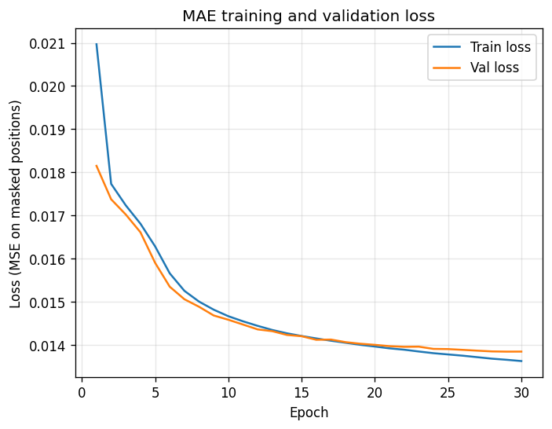
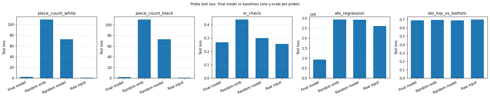

# Embedding pipeline report

## How to read this report

- **MAE loss**: Mean squared error (MSE) between predicted and true 8×8×12 piece planes, averaged only over **masked** squares. Unit: squared error per masked position per channel; targets are 0/1 so scale is 0–1. Lower is better; typical range 0.01–0.05 after training.

- **Probe losses**: Regression probes (piece count, elo) report **MSE** (piece count in count², elo in Elo²). Classification probes (in_check, elo top vs bottom) report **log loss** (nats; random guessing ≈ 0.69). Lower is better.

- **Baseline**: Loss of predicting the **mean** (constant predictor). **Improvement %** = (1 − model_loss / baseline_loss) × 100; higher means the model is better than guessing the average.

## 1. MAE training

| Epoch | Train loss | Val loss |
|-------|------------|----------|
| 1 | 0.020967 | 0.018148 |
| 2 | 0.017730 | 0.017373 |
| 3 | 0.017232 | 0.017019 |
| 4 | 0.016807 | 0.016608 |
| 5 | 0.016282 | 0.015901 |
| 6 | 0.015656 | 0.015346 |
| 7 | 0.015251 | 0.015056 |
| 8 | 0.015001 | 0.014881 |
| 9 | 0.014814 | 0.014679 |
| 10 | 0.014662 | 0.014580 |
| 11 | 0.014544 | 0.014469 |
| 12 | 0.014439 | 0.014357 |
| 13 | 0.014343 | 0.014315 |
| 14 | 0.014266 | 0.014228 |
| 15 | 0.014204 | 0.014199 |
| 16 | 0.014148 | 0.014116 |
| 17 | 0.014094 | 0.014121 |
| 18 | 0.014047 | 0.014062 |
| 19 | 0.013999 | 0.014025 |
| 20 | 0.013960 | 0.013998 |
| 21 | 0.013917 | 0.013968 |
| 22 | 0.013886 | 0.013953 |
| 23 | 0.013844 | 0.013957 |
| 24 | 0.013805 | 0.013905 |
| 25 | 0.013776 | 0.013900 |
| 26 | 0.013747 | 0.013882 |
| 27 | 0.013712 | 0.013863 |
| 28 | 0.013678 | 0.013846 |
| 29 | 0.013652 | 0.013841 |
| 30 | 0.013623 | 0.013842 |

- **MAE baseline (predict mean):** 0.026551
- **Improvement over baseline:** 47.7%
- **Final test loss (MAE):** 0.013897

## 2. Linear probes (subset)

Test loss comparison: **final (trained) model** vs **random embedding**, **random-weights model**, **raw input** (flattened 8×8×19).

| Probe | Final (test) | Random emb | Random model | Raw input | Baseline (test) | Improvement % (final) |
|-------|--------------|------------|--------------|----------|-----------------|------------------------|
| piece_count_white | 2.0439 | 109.0042 | 72.1515 | 0.7494 | 15.2345 | 86.6% |
| piece_count_black | 2.0190 | 109.7113 | 72.6372 | 0.8000 | 15.0332 | 86.6% |
| in_check | 0.2672 | 0.4377 | 0.2994 | 0.2550 | 0.2945 | 9.3% |
| elo_regression | 925219.3750 | 2923919.7500 | 2916349.5000 | 2597910.7500 | 67191.9258 | -1277.0% |
| elo_top_vs_bottom | 0.6903 | 0.6949 | 0.6909 | 0.6993 | 0.6933 | 0.4% |

## Summary

MAE is **47.7%** better than baseline (predict mean). Probe improvements over baseline (test): 86.6%, 86.6%, 9.3%, -1277.0%, 0.4%.
